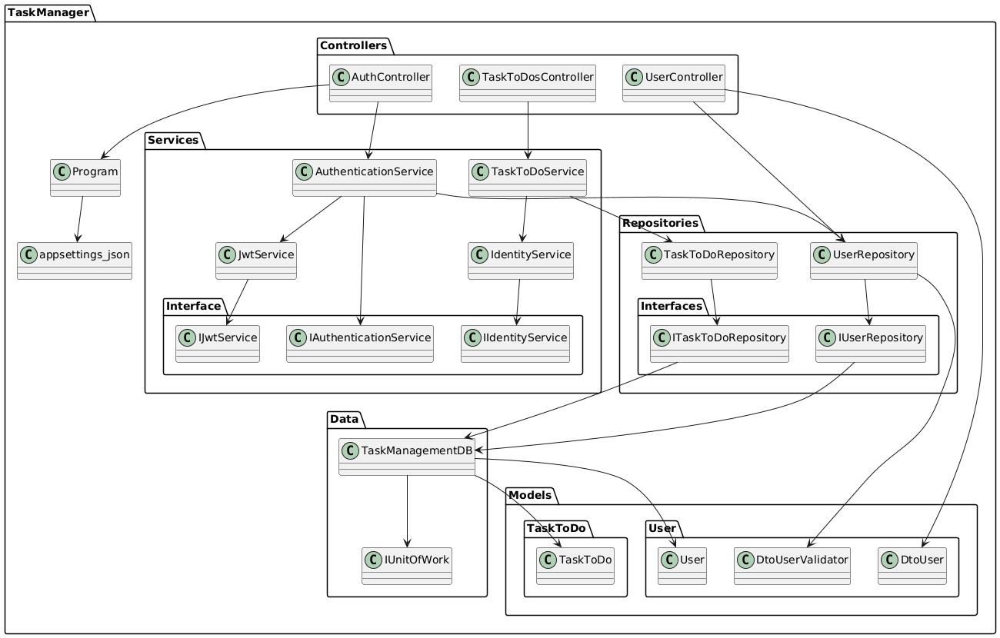

# TaskManager

TaskManager is a .NET 8 web API designed to manage tasks and users efficiently. This application leverages modern technologies and libraries to provide a robust and scalable solution for task management.

## Features

- **Task Management**: Create, update, delete, and retrieve tasks.
- **User Management**: Manage user information and authentication.
- **Task Assignment**: Assign tasks to users.
- **Authentication & Authorization**: Secure the API using JWT Bearer authentication with role-based access control.
- **Validation**: Uses FluentValidation for request model validation, Data Annotation, Fluent API.
- **Unit Testing**: Includes unit tests for controllers, services, and repositories.
- **Logging**: Logs information, warnings, and errors using Built-in Logger.
- **DTOs**: Data Transfer Objects (DTOs) are used to transfer data between the API and the client(for the User Model).
- **In-Memory Database**: Utilizes Entity Framework Core In-Memory database for development and testing.
- **API Documentation**: Integrated with Swagger for easy API exploration and testing.

## Technologies Used

- **.NET 8**
- **FluentValidation.AspNetCore**: For model validation.
- **Microsoft.AspNetCore.Authentication.JwtBearer**: For JWT-based authentication.
- **Microsoft.EntityFrameworkCore.InMemory**: For an in-memory database (useful for development and testing).
- **Swashbuckle.AspNetCore**: For Swagger API documentation.
- **Swashbuckle.AspNetCore.Annotations**: For adding Swagger annotations.
- **xUnit**: For unit testing.

## Project Structure

The project follows a structured approach but does not fully adhere to Clean Architecture principles, as it is not complex. However, if we plan to scale it, we can consider adopting Clean Architecture or Vertical Slice Architecture for better modularity and maintainability.

- **Controllers**: Manages API endpoints (`AuthController`, `TaskToDosController`, `UsersController`).
- **Data**: Contains database context (`TaskManagementDB.cs`) and Unit of Work pattern (`IUnitOfWork.cs`).
- **Models**: Defines data transfer objects (DTOs) and validation (`DtoUser.cs`, `DtoUserValidator.cs`, `TaskToDo.cs`, `User.cs`).
- **Repositories**: Implements data access logic (`TaskToDoRepository.cs`, `UserRepository.cs`).
- **Services**: Contains application configurations and settings (`appsettings.json`.`AuthenticationService.cs`,`IdentityService.cs`,`JwtService.cs`,`TaskToDoService.cs`).

## Roles and Permissions
-- **Role-based Access Control**:
	Admins can create, update, and delete all tasks.
	Users can only update the status of their assigned tasks.
	Users can only retrieve tasks assigned to them.
    Only admins can list all tasks.

## Database seed
	- The database is seeded with two users and three tasks.

## Architecture Diagram

Below is a visual representation of the application's architecture:



## Getting Started

### Prerequisites

Ensure you have the following installed:

- [.NET 8 SDK](https://dotnet.microsoft.com/download/dotnet/8.0)

### Installation

1. Clone the repository:
   ```sh
   git clone https://github.com/chekibdgham/TaskManager.git
   cd TaskManager
   ```
2. Restore dependencies:
   ```sh
   dotnet restore
   ```
3. Run the application:
   ```sh
   dotnet run --project TaskManagementAPI
   ```
4. Open the browser and navigate to `https://localhost:5001/swagger` to explore the API documentation.

## Testing

The TaskManager solution includes a separate test project using **xUnit** and **Moq** for unit testing.

### Running Tests

To execute tests, run the following command:

```sh
   dotnet test
```

## Contributing

Contributions are welcome! If you'd like to contribute:

1. Fork the repository.
2. Create a feature branch (`git checkout -b feature-branch`).
3. Commit your changes (`git commit -m "Add new feature"`).
4. Push to the branch (`git push origin feature-branch`).
5. Open a pull request.

## License

This project is licensed under the MIT License. See the `LICENSE` file for details.

